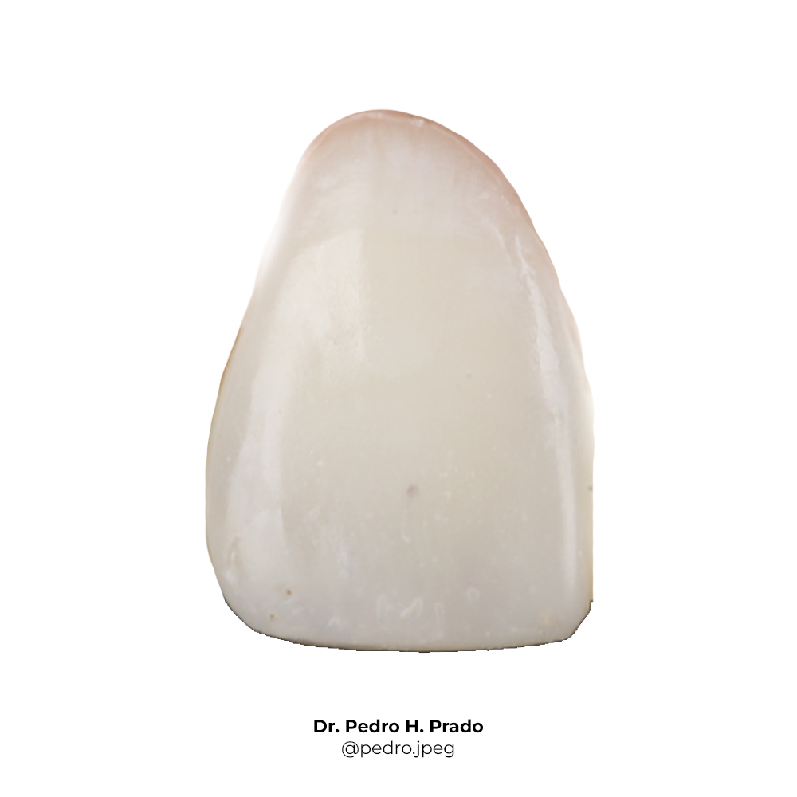

# 🦷 Dental Anatomy Quiz App

An interactive educational app to practice and test your knowledge of dental anatomy using the FDI tooth numbering system. Built with **React** on the frontend and **Vercel Serverless Functions** as the backend.



## 🚀 Features

- Displays random tooth images and asks for the correct FDI code
- Instant feedback with correction
- Score tracking across the session
- Fully deployed on Vercel (frontend + backend API routes)

## 🛠 Technologies Used

- [React](https://reactjs.org/)
- [Vercel Serverless Functions](https://vercel.com/docs/functions)
- [Create React App](https://create-react-app.dev/)
- [Vercel CLI](https://vercel.com/docs/cli)

## 📁 Project Structure

```
teeth_study_guide/
├── api/              # Vercel backend routes
│   ├── question.js   # Returns a random tooth with image and name
│   └── verify.js     # Verifies the user input
├── public/           # Static files (images, index.html, etc.)
│   └── images/       # Tooth images (e.g., 11.png, 12.png, ...)
├── src/              # React frontend code
│   ├── App.js        # Main component
│   └── index.js      # ReactDOM renderer
├── package.json      # Combined dependencies and scripts
```

## 🧪 Local Development

### 1. Install dependencies

```bash
npm install
```

### 2. Start local dev server (frontend + API)

```bash
vercel dev
```

Open: [http://localhost:3000](http://localhost:3000)

## 🚀 Deployment

### One-time setup

```bash
vercel login
vercel link
```

### Deploy to preview (private)

```bash
vercel
```

### Deploy to production (public)

```bash
vercel --prod
```

Your app will be live at:

```
https://<your-project>.vercel.app
```

## 📚 Tooth Data

Uses the **FDI World Dental Federation notation**:
- 11–18, 21–28, 31–38, 41–48
- Example: `11` → *Incisivo Central Superior Direito*

Tooth images must be named using their code (e.g., `11.png`) and placed in:

```
/public/images/
```

## 📜 License

MIT — free for academic and personal use.

## 🙌 Author

Made by Pedro Prado and Marco Prado.
